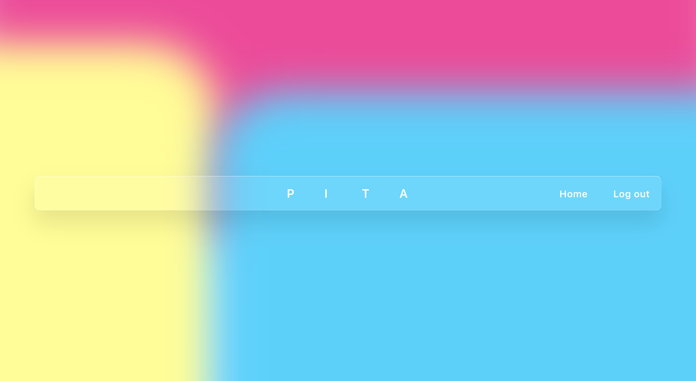
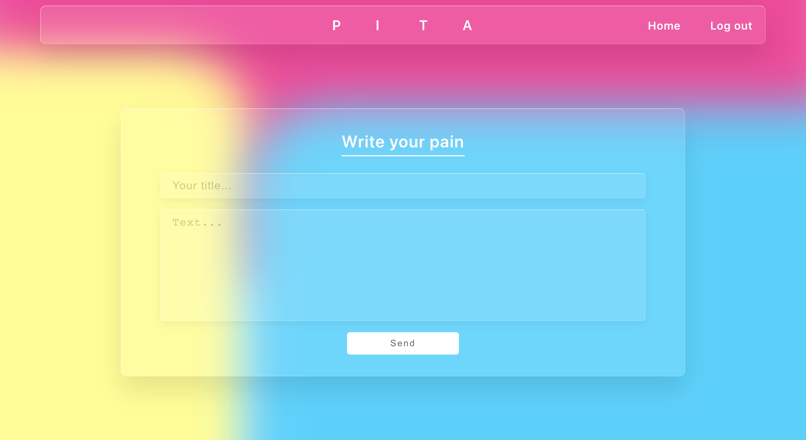
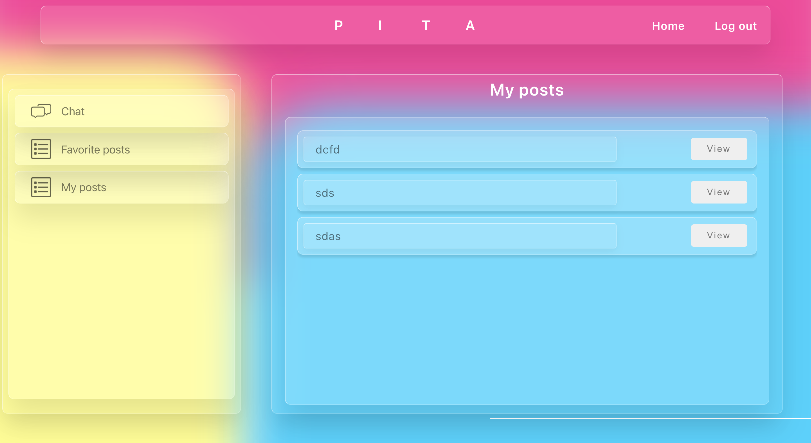

# PITA

Приложение, объединяющее людей у которых есть инструменты и желание создать что-то полезное, но нет идей и людей у которых есть идеи, но нет инструментов.

Введение
-----------


Рисунок 1. Главная страница


Рисунок 2. Вкладка PAIN


Рисунок 3. Вкладка INSPIRATION


Рисунок 4. Вкладка TOOLS


Рисунок 5. Вкладка ADMIN


В планах
-----------
Мобильная версия приложения на react-native
Возможность коммуникаций между пользователями.

Запуск
-----------
В папках 
/client
/server


запустить команду

```
npm i
npm start

